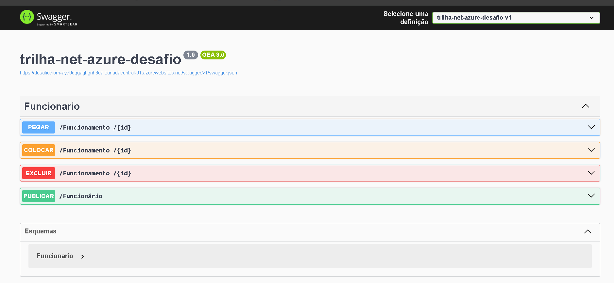
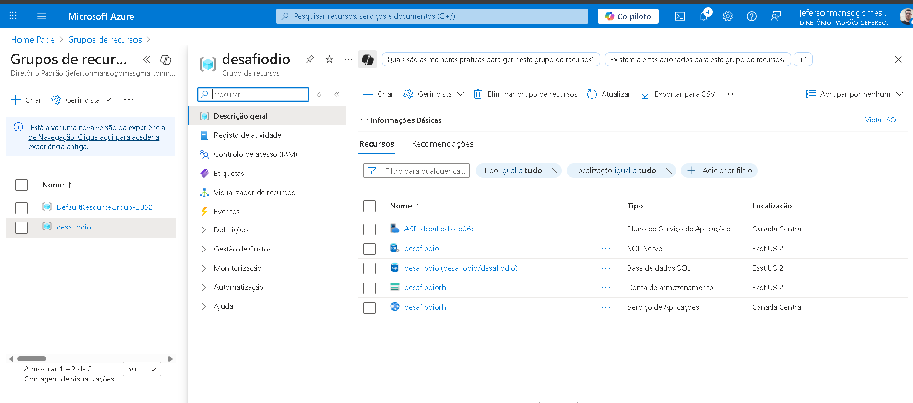
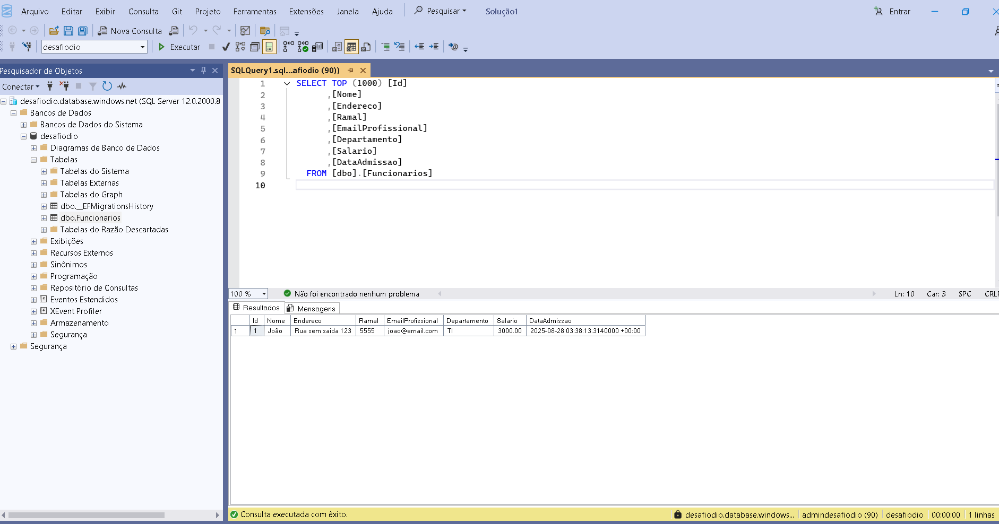
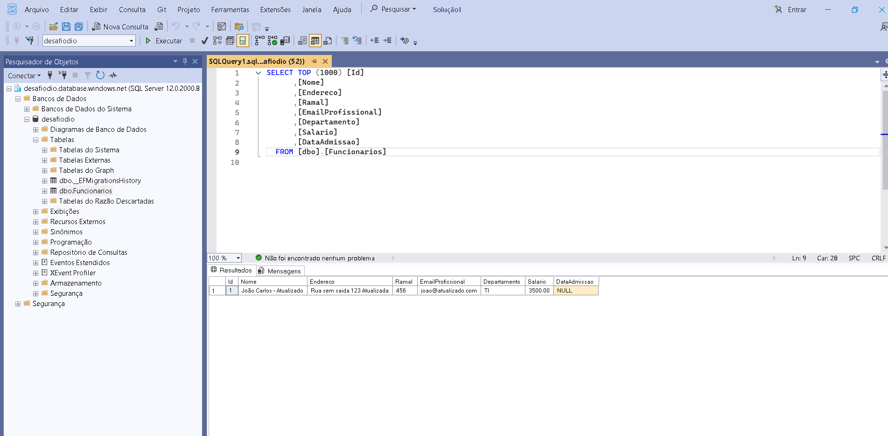
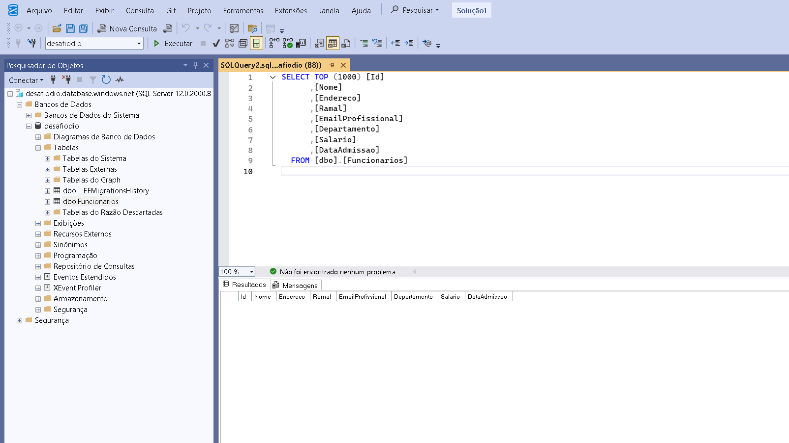
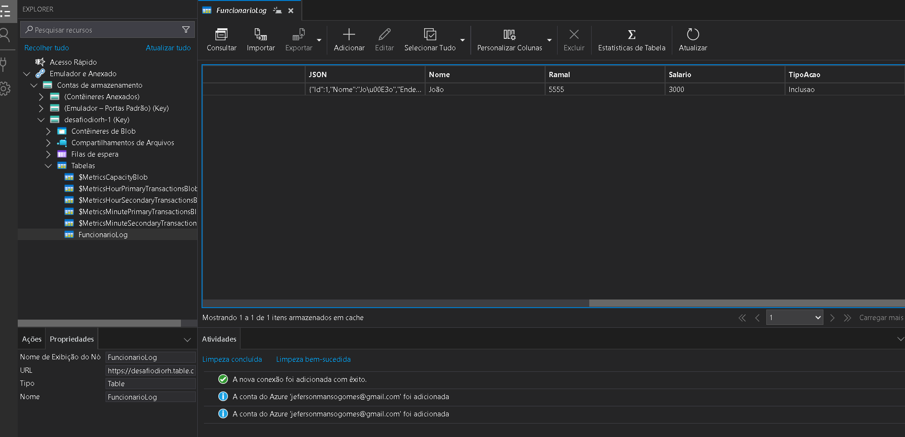
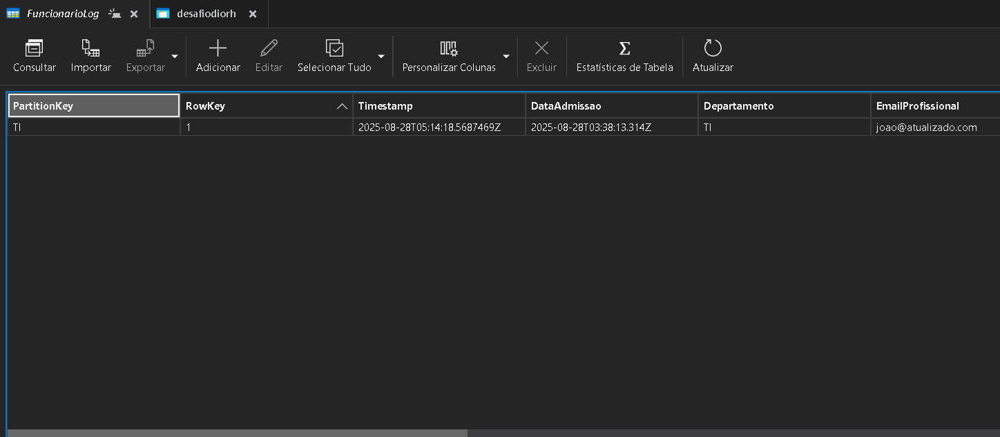
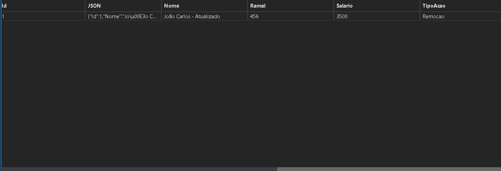

# 📌 Sistema de Cadastro de RH – Deploy no Microsoft Azure
---
## 🚀 Desafio de Projeto

Este projeto consiste em desenvolver e publicar uma API de cadastro de funcionários de RH na nuvem utilizando Microsoft Azure.

A API permite cadastrar, consultar, atualizar e remover funcionários (CRUD), além de armazenar logs de todas as alterações em uma Azure Table.

---
## 📋 Contexto

O objetivo é construir um sistema de RH simples para gestão de funcionários.

Cada funcionário possui informações como: nome, endereço, ramal, e-mail profissional, departamento, salário e data de admissão.

- O sistema armazena um log de toda modificação, para auditoria e rastreabilidade.

- A aplicação foi desenvolvida como Web API com .NET.

- Foi realizado o deploy no Microsoft Azure, utilizando:

- App Service → Hospedagem da API.

- SQL Database → Armazenamento relacional dos funcionários.

- Azure Table Storage → Persistência dos logs.

---
# 📐 Diagrama das Classes
Entidades principais:

- Funcionario

- FuncionarioLog (herda de Funcionario)


A classe FuncionarioLog herda de Funcionario para reutilizar seus atributos, adicionando campos específicos de auditoria como tipo de ação e timestamp.


## Métodos esperados
Métodos do Swagger conforme a seguir:


**Swagger**





**Endpoints**


| Verbo  | Endpoint                | Parâmetro | Body               |
|--------|-------------------------|-----------|--------------------|
| GET    | /Funcionario/{id}       | id        | N/A                |
| PUT    | /Funcionario/{id}       | id        | Schema Funcionario |
| DELETE | /Funcionario/{id}       | id        | N/A                |
| POST   | /Funcionario            | N/A       | Schema Funcionario |

Esse é o schema (model) de Funcionario, utilizado para passar para os métodos que exigirem:

```json
{
  "nome": "Joao Carlos",
  "endereco": "Rua sem saida 1234",
  "ramal": "5555",
  "emailProfissional": "joao@email.com",
  "departamento": "TI",
  "salario": 3000,
  "dataAdmissao": "2025-08-28T02:52:36.345Z"
}
```

## ☁️ Arquitetura no Azure

O ambiente na nuvem foi configurado da seguinte forma:

- App Service → Hospeda a API de RH.

- SQL Database → Contém os dados dos funcionários.

- Azure Table Storage → Guarda os logs das alterações (INSERT, UPDATE, DELETE).


---

⚙️ Tecnologias Utilizadas

- .NET 8 Web API

- Entity Framework Core

- Microsoft Azure App Service

- Azure SQL Database

- Azure Table Storage

- Swagger / OpenAPI


---
# Estrutura do repositório

```
trilha-net-azure-desafio/        
├─ docs/
│  ├─ Imagens/
│  │  ├─ diagrama_classe.png
│  │  ├─ diagrama_api.png
│  │  ├─ recursoscriados.png
│  │  ├─ bdcadastrar.png
│  │  ├─ bdatualizar.png
│  │  ├─ bdremover.png
│  │  ├─ loginclusao.png
│  │  ├─ logatualizado.png
│  │  └─ logremocao.png
├─ API/
│  └─ ├─ Controllers/
│     │  └─ FuncionarioController.cs
│     ├─ Context/
│     │  └─ RHContext.cs
│     ├─ Models/
│     │  ├─ Funcionario.cs
│     │  ├─ FuncionarioLog.cs
│     │  └─ TipoAcao.cs
│     ├─ Properties/
│     │  └─ launchSettings.json
│     ├─ Program.cs
│     ├─ trilha-net-azure-desafio.csproj
│     └─ appsettings.json        
├─ tests/
│  └─ trilha-net-azure-desafio.Tests/
│     ├─ UnitTests.cs
│     └─ trilha-net-azure-desafio.Tests.csproj
├─ .gitignore
├─ trilha-net-azure-desafio.sln
└─ README.md

```

## 🚀 Deploy no Azure

**Recursos criados no Azure**  


---

## 📤 Cadastro no SQL


---

## ✏️ Atualização no SQL


---

## ❌ Remoção no SQL


---
## 📝 Log de Inclusão 


---

## 🔄 Log de Atualização 


---

## 🗑️ Log de Remoção 


---